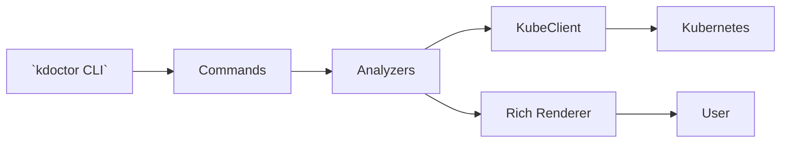

<!--
KDoctor — Your Kubernetes Troubleshooting Assistant
Production-ready README intended for an open-source CNCF-style project.
Replace OWNER/REPO in badges with your repository values.
-->

# KDoctor
Your Kubernetes Troubleshooting Assistant

[](https://github.com/OWNER/REPO/actions)
[](https://pypi.org/project/kdoctor)
[](https://pypi.org/project/kdoctor)
[](LICENSE)
[](https://codecov.io/gh/OWNER/REPO)

KDoctor is a Kubernetes diagnostics and troubleshooting CLI for DevOps, Platform, SRE, and Cloud Engineers. It aggregates cluster, pod, and deployment signals into concise health scores, risk assessments, and prioritized recommendations — reducing mean time to resolution (MTTR).

## Table of Contents
- [Why KDoctor?](#why-kdoctor)
- [Highlights](#highlights)
- [Badges](#badges)
- [Features](#features)
- [Feature Matrix](#feature-matrix)
- [Comparison](#comparison)
- [Project Architecture](#project-architecture)
- [Installation](#installation)
- [Local Development](#local-development)
- [Command Reference](#command-reference)
- [Screenshots](#screenshots)
- [Roadmap](#roadmap)
- [Contributing](#contributing)
- [Code of Conduct](#code-of-conduct)
- [License](#license)

## Why KDoctor?
KDoctor helps you quickly identify and diagnose Kubernetes issues without manually running dozens of `kubectl` commands. It provides:

- Actionable outputs: human-friendly health scores and prioritized remediation steps.
- Context-aware analysis: combines events, resource state, and rollout history.
- Extensibility: modular analyzers and a clean client layer for integrations.

## Highlights

- Fast, scriptable CLI built with `typer` and rendered with `rich`.
- Cluster, Pod, and Deployment analysis with risk scoring and recommendations.
- Diff and rollout history tools to accelerate deployment investigations.

## Badges
Replace `OWNER/REPO` with your GitHub repository owner/name in the badge URLs.

## Features

Core commands:

- `kdoctor cluster analyze` — Cluster-level diagnostics and scoring
- `kdoctor cluster analyze --details` — Extended cluster checks
- `kdoctor pod analyze POD_NAME -n NAMESPACE` — Pod-level diagnostics
- `kdoctor deployment investigate DEPLOYMENT_NAME -n NAMESPACE [--deep]` — Deployment investigation
- `kdoctor deployment rollout-history DEPLOYMENT_NAME -n NAMESPACE` — Rollout timeline & revisions
- `kdoctor deployment diff DEPLOYMENT_NAME REV1 REV2 -n NAMESPACE` — Deployment revision diff

Capabilities (high level): node health, pod health scoring, probe validation, restart analysis, replica and rollout analysis, image/env/resource/secret/ConfigMap diffs, risk assessment, and recommendations.

## Feature Matrix

| Feature / Command | Cluster Analyze | Pod Analyze | Deployment Investigate | Rollout History | Deployment Diff |
|---|:---:|:---:|:---:|:---:|:---:|
| Health scoring | ✅ | ✅ | ✅ | ❌ | ❌ |
| Node health | ✅ | ❌ | ❌ | ❌ | ❌ |
| Pod summary | ✅ | ✅ | ✅ | ❌ | ❌ |
| Probe validation | ❌ | ✅ | ✅ | ❌ | ❌ |
| Restart analysis | ✅ | ✅ | ✅ | ✅ | ❌ |
| Replica analysis | ❌ | ❌ | ✅ | ✅ | ❌ |
| Image comparison | ❌ | ❌ | ✅ | ✅ | ✅ |
| Env / Config diff | ❌ | ❌ | ✅ | ❌ | ✅ |
| Secret comparison | ❌ | ❌ | ✅ | ❌ | ✅ |
| Risk assessment | ✅ | ✅ | ✅ | ❌ | ✅ |
| Recommendations | ✅ | ✅ | ✅ | ✅ | ✅ |

## Comparison: KDoctor vs kubectl vs Lens vs K9s

| Capability | KDoctor | kubectl | Lens | K9s |
|---|---:|:---:|:---:|:---:|
| Interactive UI | ❌ | ❌ | ✅ | ✅ |
| One-command diagnostics | ✅ | ❌ | ❌ | ❌ |
| Health scoring & risk assessment | ✅ | ❌ | ❌ | ❌ |
| Pod/Container deep analysis | ✅ | ❌ | ✅ | ✅ |
| Deployment diffs & risk summary | ✅ | ❌ | ✅ (partial) | ❌ |
| Automatable CLI output | ✅ | ✅ | ❌ | ❌ |
| Integrations (monitoring, AI) | Planned | Manual | Plugins | Plugins |
| Best for quick triage | ✅ | ✅ | ✅ | ✅ |

Notes: `kubectl` is the canonical control-plane tool; Lens and K9s are interactive UIs. KDoctor focuses on curated, repeatable diagnostics and recommendations useful for automation and on-call triage.

## Project Architecture

KDoctor is a modular Python CLI. Important packages:

- `kdoctor.main` — CLI entrypoint (Typer)
- `kdoctor.analyzers` — cluster, pod, and deployment analyzers (domain checks and scoring)
- `kdoctor.clients.kube_client` — Kubernetes API wrapper
- `kdoctor.commands` — Typer command groups
- `kdoctor.utils.output` — Rich rendering helpers

Mermaid flow:



Design principles: keep analyzers small and testable, separate I/O/client code, and produce both human-friendly and machine-readable outputs.

## Installation

Install from PyPI:

```bash
pip install kdoctor
```

From source:

```bash
git clone https://github.com/OWNER/REPO.git
cd REPO
python -m venv .venv
source .venv/bin/activate
pip install -r requirements.txt
pip install -e .
```

Prerequisites: Python 3.9+, kubeconfig or in-cluster credentials with sufficient RBAC for the checks you intend to run.

## Local Development

```bash
# clone and set up
git clone https://github.com/OWNER/REPO.git
cd REPO
python -m venv .venv
source .venv/bin/activate
pip install -U pip setuptools
pip install -r requirements.txt
pip install -e .

# lint, format, and tests
pre-commit install
pre-commit run --all-files
pytest tests
```

Tips: run CLI commands against a test cluster and mock the `kube_client` in unit tests.

## Command Reference

Cluster analysis:

```bash
kdoctor cluster analyze
kdoctor cluster analyze --details
```

Pod analysis:

```bash
kdoctor pod analyze POD_NAME -n NAMESPACE
```

Deployment investigation:

```bash
kdoctor deployment investigate DEPLOYMENT_NAME -n NAMESPACE
kdoctor deployment investigate DEPLOYMENT_NAME -n NAMESPACE --deep
```

Rollout history:

```bash
kdoctor deployment rollout-history DEPLOYMENT_NAME -n NAMESPACE
```

Deployment diff:

```bash
kdoctor deployment diff DEPLOYMENT_NAME REVISION1 REVISION2 -n NAMESPACE
```

Options: `--details` for extended checks; `--output json` for CI-friendly output.

## Screenshots

Add real screenshots to `docs/images/` to illustrate outputs. Current placeholders:

- Cluster Analysis: [docs/images/cluster-analysis.svg](docs/images/cluster-analysis.svg)
- Pod Analysis: [docs/images/pod-analysis.svg](docs/images/pod-analysis.svg)
- Deployment Investigation: [docs/images/deployment-investigation.svg](docs/images/deployment-investigation.svg)

## Roadmap

Planned items:

- Namespace Investigation
- Rollback Advisor
- AI-powered Root Cause Analysis
- Prometheus Integration
- Grafana Integration
- Deployment Drift Detection
- Kubernetes Best Practices Audit
- Cost Optimization Recommendations

## Contributing

We welcome contributors. See `CONTRIBUTING.md` for the full workflow, testing guidance, and PR checklist.

High level:

- Open issues for feature proposals or bugs.
- Fork and branch: `git checkout -b feat/my-feature`.
- Add tests and documentation for new behavior.
- Keep PRs focused and include screenshots or sample outputs when relevant.

## Code of Conduct

This project follows the Contributor Covenant. See `CODE_OF_CONDUCT.md` for details.

## Security

Report security issues privately (see `MAINTAINERS.md`), do not publish vulnerabilities publicly until fixed.

## License

See the `LICENSE` file in the repository for full license terms.

## Maintainers

Primary maintainers: replace with actual maintainers in `MAINTAINERS.md`.

---

If you want, I can open a PR with these files or add more docs and CI integrations.